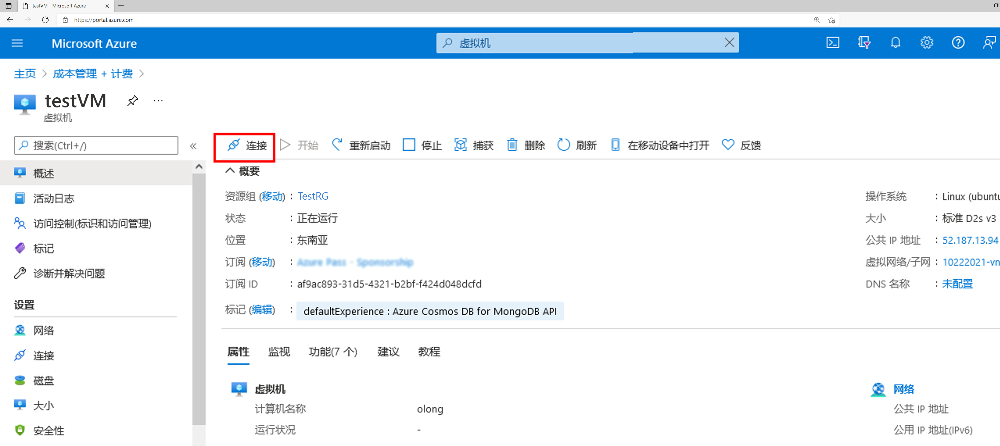
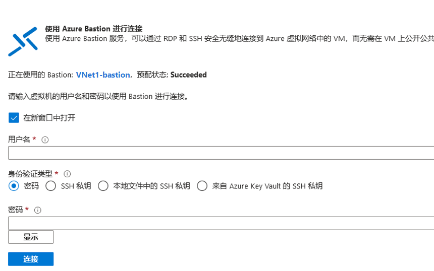

# 演示：使用 Azure Bastion 创建到 Linux VM 的 SSH 连接

In this demo you will use the Azure portal and your username and password to create an SSH connection to a Linux VM located in an Azure virtual network. When you use Azure Bastion, your VMs don't require a client, agent, or additional software.

## 先决条件

To complete this demo, you will require an Azure virtual network containing a Linux VM. For more information about how to create an Azure VM, see <bpt id="p1">[</bpt>Demonstration: Create a virtual machine in the portal<ept id="p1">](https://github.com/MicrosoftLearning/AZ-120-Planning-and-Administering-Microsoft-Azure-for-SAP-Workloads/blob/master/Demos/demo-create-virtual-machine-portal.md)</ept>, or <bpt id="p2">[</bpt>Demonstration: Create a virtual machine with PowerShell<ept id="p2">](https://github.com/MicrosoftLearning/AZ-120-Planning-and-Administering-Microsoft-Azure-for-SAP-Workloads/blob/master/Demos/demo-create-virtual-machine-powershell.md)</ept>.

在本演示中，你将使用 Azure 门户以及你的用户名和密码与位于 Azure 虚拟网络中的 Linux VM 建立 SSH 连接。 

### 必需的角色

需要使用以下角色进行连接：

* 虚拟机上的读者角色
* NIC 上的读者角色（使用虚拟机的专用 IP）
* Azure Bastion 资源上的读者角色

### 端口

若要通过 SSH 连接到 Linux VM，必须在 VM 上打开以下端口：

* 入站端口：SSH (22) 或
* 入站端口：自定义值（然后，你需要在通过 Azure Bastion 连接到 VM 时指定此自定义端口）

> 使用 Azure Bastion 时，VM 不需要客户端、代理或其他软件。

## 连接：使用用户名和密码

1. Open the <bpt id="p1">[</bpt>Azure portal<ept id="p1">](https://portal.azure.com)</ept>. Navigate to the virtual machine that you want to connect to, select <bpt id="p1">**</bpt>Connect<ept id="p1">**</ept>, and then select <bpt id="p2">**</bpt>Bastion<ept id="p2">**</ept> from the dropdown.

    

1. Select <bpt id="p1">**</bpt>Use Bastion<ept id="p1">**</ept>. If you didn't provision Bastion for the virtual network, see <bpt id="p1">[</bpt>Configure Bastion<ept id="p1">](https://docs.microsoft.com/azure/bastion/quickstart-host-portal)</ept>.
1. 在“使用 Azure Bastion 连接”页上，输入“用户名”和“密码”  。

    

1. 选择“连接”以连接到 VM。