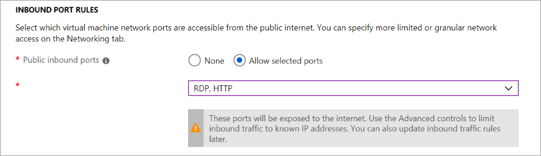
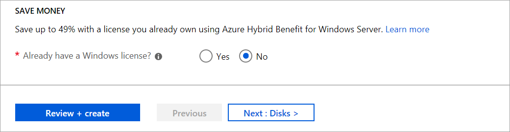

# <a name="demonstration-create-a-virtual-machine-in-the-portal"></a>演示：在门户中创建虚拟机

在本演示中，我们将在门户中创建并访问 Windows 虚拟机。

## <a name="create-the-virtual-machine"></a>创建虚拟机

1. 在 Azure 门户的左上角选择“创建资源”。
2. 在 Azure 市场资源列表上方的搜索框中，搜索“Windows Server 2016 Datacenter”。 找到映像后，单击“创建”。
3. 在“基本信息”标签页中的“项目详细信息”下，确保选择了正确的订阅，然后选择“新建资源组”。 对于名称，请键入 *myResourceGroup*。

    

4. 在“实例详细信息”下，对于“虚拟机名称”键入 *myVM*，对于“位置”选择“美国东部”。 保留其他默认值。

    

5. 在“管理员帐户”下提供用户名（例如 *azureuser*）和密码。 密码必须至少 12 个字符，且符合定义的复杂性要求。

    

6. 在“入站端口规则”下，选择“允许所选端口”，然后从下拉列表中选择“RDP (3389)”和“HTTP”。

    

7. 移至“管理”选项卡，在“监视”下，关闭启动诊断。 这将消除验证错误。 
8. 保留其余默认值，然后选择页面底部的“查看 + 创建”按钮。 等待验证，然后单击“创建”。 

    

## <a name="connect-to-the-virtual-machine"></a>连接到虚拟机

创建与虚拟机的远程桌面连接。 这些说明指明了如何从 Windows 计算机连接到 VM。 在 Mac 上，你需要从 Mac App Store 安装 RDP 客户端。

1. 在虚拟机属性页面上，选择“连接”按钮。
2. 在“连接到虚拟机”页面中，保留默认选项，以使用 DNS 名称通过端口 3389 进行连接，然后单击“下载 RDP 文件”。
3. 打开下载的 RDP 文件，然后在出现提示时选择“连接”。
4. 在“Windows 安全性”窗口中，依次选择“更多选择”、“使用其他帐户”。 键入 localhost \username 作为用户名，输入你为虚拟机创建的密码，然后选择“确定”。
5. 你可能会在登录过程中收到证书警告。 选择“是”或“继续”以创建连接。  

## <a name="install-web-server"></a>安装 Web 服务器

要查看运行中的 VM，请安装 IIS Web 服务器。 在 VM 中打开 PowerShell 提示符并运行以下命令：

```PowerShell
Install-WindowsFeature -name Web-Server -IncludeManagementTools
```

完成后，关闭到 VM 的 RDP 连接。

## <a name="view-the-iis-welcome-page"></a>查看 IIS 欢迎页

在门户中选择 VM，然后在 VM 的概述部分，使用公共 IP 地址右侧的“单击以复制”按钮将其复制并粘贴到浏览器选项卡中。随即将打开默认的 IIS 欢迎页面。


## <a name="clean-up-resources"></a>清理资源

>**注意：** 不再需要时，可以删除资源组、虚拟机和所有相关资源。 为此，请选择虚拟机的资源组，选择“删除”，然后确认要删除的资源组的名称。