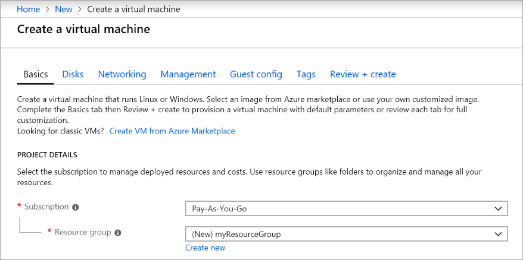

# <a name="demonstration-create-a-virtual-machine-in-the-portal"></a>演示：在门户中创建虚拟机

在本演示中，我们将在门户中创建并访问 Windows 虚拟机。

## <a name="create-the-virtual-machine"></a>创建虚拟机

1. 在 Azure 门户的左上角选择“创建资源”。
2. In the search box above the list of Azure Marketplace resources, search for <bpt id="p1">**</bpt>Windows Server 2016 Datacenter<ept id="p1">**</ept>. After locating the image, click <bpt id="p1">**</bpt>Create<ept id="p1">**</ept>.
3. In the <bpt id="p1">**</bpt>Basics<ept id="p1">**</ept> tab, under <bpt id="p2">**</bpt>Project details<ept id="p2">**</ept>, make sure the correct subscription is selected and then choose to <bpt id="p3">**</bpt>Create new<ept id="p3">**</ept> resource group. Type <bpt id="p1">*</bpt>myResourceGroup<ept id="p1">*</ept> for the name.

    

4. Under <bpt id="p1">**</bpt>Instance details<ept id="p1">**</ept>, type <bpt id="p2">*</bpt>myVM<ept id="p2">*</ept> for the <bpt id="p3">**</bpt>Virtual machine name<ept id="p3">**</ept> and choose <bpt id="p4">*</bpt>East US<ept id="p4">*</ept> for your <bpt id="p5">**</bpt>Location<ept id="p5">**</ept>. Leave the other defaults.

    

5. Under <bpt id="p1">**</bpt>Administrator account<ept id="p1">**</ept>, provide a username, such as <bpt id="p2">*</bpt>azureuser<ept id="p2">*</ept> and a password. The password must be at least 12 characters long and meet the defined complexity requirements.

    

6. 在“入站端口规则”**** 下，选择“允许所选端口”****，然后从下拉列表中选择“RDP (3389)”**** 和“HTTP”****。

    

7. Move to the <bpt id="p1">**</bpt>Management<ept id="p1">**</ept> tab, and under <bpt id="p2">**</bpt>Monitoring<ept id="p2">**</ept> turn <bpt id="p3">**</bpt>Off<ept id="p3">**</ept> Boot Diagnostics. This will eliminate validation errors. 
8. 在 Azure 市场资源列表上方的搜索框中，搜索“Windows Server 2016 Datacenter”。 

    

## <a name="connect-to-the-virtual-machine"></a>连接到虚拟机

找到映像后，单击“创建”。

1. 在虚拟机属性页面上，选择“连接”按钮。
2. 在“连接到虚拟机”**** 页面中，保留默认选项，以使用 DNS 名称通过端口 3389 进行连接，然后单击“下载 RDP 文件”****。
3. 打开下载的 RDP 文件，然后在出现提示时选择“连接”。
4. In the <bpt id="p1">**</bpt>Windows Security<ept id="p1">**</ept> window, select <bpt id="p2">**</bpt>More choices<ept id="p2">**</ept> and then <bpt id="p3">**</bpt>Use a different account<ept id="p3">**</ept>. Type the username as localhost\username, enter password you created for the virtual machine, and then select <bpt id="p1">**</bpt>OK<ept id="p1">**</ept>.
5. 在“基本信息”标签页中的“项目详细信息”下，确保选择了正确的订阅，然后选择“新建资源组”。

## <a name="install-web-server"></a>安装 Web 服务器

对于名称，请键入 *myResourceGroup*。

```PowerShell
Install-WindowsFeature -name Web-Server -IncludeManagementTools
```

完成后，关闭到 VM 的 RDP 连接。

## <a name="view-the-iis-welcome-page"></a>查看 IIS 欢迎页

在门户中选择 VM，然后在 VM 的概述部分，使用公共 IP 地址右侧的“单击以复制”按钮将其复制并粘贴到浏览器选项卡中。随即将打开默认的 IIS 欢迎页面。


## <a name="clean-up-resources"></a>清理资源

><bpt id="p1">**</bpt>Note:<ept id="p1">**</ept> When no longer needed, you can delete the resource group, virtual machine, and all related resources. To do so, select the resource group for the virtual machine, select <bpt id="p1">**</bpt>Delete<ept id="p1">**</ept>, then confirm the name of the resource group to delete.