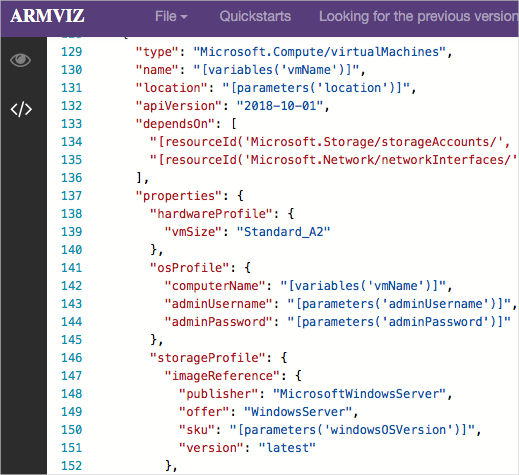

# <a name="demonstration-explore-quickstart-templates"></a>演示：了解快速启动模板

## <a name="explore-the-gallery"></a>探索模板库

1. You could start by browsing to the <bpt id="p1">[</bpt>Azure Quickstart Templates gallery<ept id="p1">](https://azure.microsoft.com/resources/templates?azure-portal=true)</ept>. In the gallery you will find a number of popular and recently updated templates. These templates work with both Azure resources and popular software packages.
2. 浏览多种不同类型的可用模板。
3. 是否有你感兴趣的模板？

## <a name="explore-a-template"></a>探索模板

1. 假设我们无意中发现<a href="https://azure.microsoft.com/resources/templates/101-vm-simple-windows?azure-portal=true" target="_blank"><span style="color: #0066cc;" color="#0066cc">部署简单 Windows VM</span></a> 模板。

    

    >**注意：**
    >- 使用“部署到 Azure”按钮可根据需要直接通过 Azure 门户部署模板。
    >- Scroll-down to the Use the template <bpt id="p1">**</bpt>PowerShell<ept id="p1">**</ept> code. You will need the <bpt id="p1">**</bpt>TemplateURI<ept id="p1">**</ept> in the next demo. <bpt id="p1">**</bpt>Copy the value<ept id="p1">**</ept>. 

```
https://raw.githubusercontent.com/Azure/azure-quickstart-templates/master/101-vm-simple-windows/azuredeploy.json
```

2. 单击“在 GitHub 中浏览”，导航到 GitHub 上的模板源代码。

    

3. Notice from this page you can also <bpt id="p1">**</bpt>Deploy to Azure<ept id="p1">**</ept>. Take a minute to view the Readme file. This helps to determine if the template is for you.  

4. 单击“可视化”导航到“Azure 资源管理器可视化工具” 。

    

5. 注意构成部署的资源，包括 VM、存储帐户和网络资源。
6. 你可以首先浏览到 [Azure 快速启动模板库](https://azure.microsoft.com/resources/templates?azure-portal=true)。
7. 单击标签为“SimpleWinVM”的 VM 资源。

    

8. 查看定义 VM 资源的源代码。

    * 资源类型为 `Microsoft.Compute/virtualMachines`。
    * 其位置或 Azure 区域来自名为 `location` 的模板参数。
    * VM 的大小为 Standard_A2****。
    * 计算机名称读取自模板变量，VM 的用户名和密码读取自模板参数。

9. 在该库中，你将找到许多最近更新的热门模板。

>**注意：** 下一个演示需要用到该模板链接。