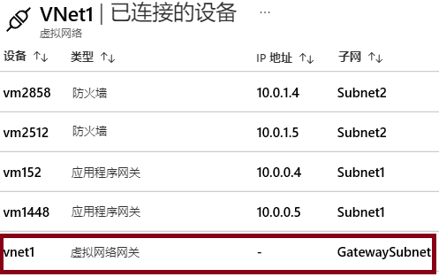

# 演示：探索 VNet 到 VNet 连接

>**备注**：此演示最适用于两个具有子网的虚拟网络。所有步骤都在门户中。 

## 浏览“网关子网”边栏选项卡

1. 对于其中一个虚拟网络，请选择“**子网**”边栏选项卡。
1. 选择“**+ 网关子网**”。

    - 请注意，无法更改子网名称。  
    - 注意网关子网的“**地址范围**” 。该地址必须包含在虚拟网络的地址空间中。 

1. 请记住，每个虚拟网络都需要一个网关子网。 
1. 关闭"添加网关子网"页面。你无需保存更改。

## 浏览“已连接设备”边栏选项卡

1. 对于该虚拟网络，请选择“**已连接设备**”边栏选项卡。
2. 部署网关子网后，它将显示在已连接设备列表中。

## 浏览如何添加虚拟网络网关

1. 搜索“**虚拟网络网关**”。
2. 单击“**+ 添加**”。
3. 查看虚拟网络网关的各项设置。
4. 使用“信息”图标获取有关设置的更多信息。
5. 注意“**网关类型**”、“**VPN 类型**”和“**SKU**”。 
6. 注意需要一个“**公共 IP 地址**”。
7. 请记住，每个虚拟网络都需要一个虚拟网络网关。 
8. 关闭“**添加虚拟网络网关**”页。你无需保存更改。 

## 探索如何在虚拟网络之间添加连接

1. 搜索“**连接**”。
2. 单击“**+ 添加**”。
3. 请注意“**连接类型**”可以是 VNet 到 VNet、站点到站点 (Ipsec) 或 ExpressRoute。
4. 提供足够的信息后，方可单击“**确认**”按钮。
5. 在“**设置**”页，请注意你将需要选择两个不同的虚拟网络。
6. 阅读“建立双向连接”复选框上的的“**帮助**”信息。
7. 请注意“**共享密钥 (PSK)**”信息。
8. 关闭“**添加连接**”页。你无需保存更改。 
